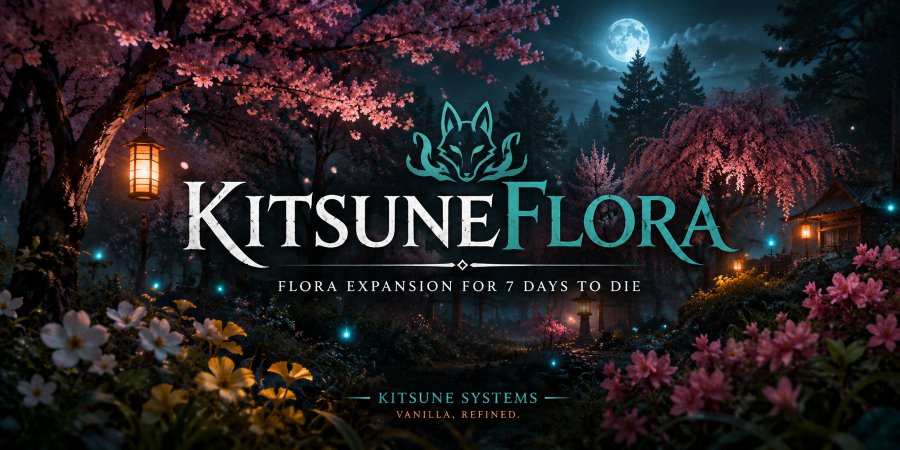

<p align="center">
  
</p>

# KitsuneFlora


[](https://github.com/Kitsune-Den/KitsuneFlora/actions/workflows/tests.yml)


Standalone 7 Days to Die V2.6 mod adding ten Japanese-themed trees and garden plants: **sakura** (cherry blossom ~ bloom + leaf variants), **keyaki** (Japanese zelkova), **dogwood** (pink + white hanamizuki), **plane tree** (suzukake-no-ki), **bamboo**, **black pine** (kuromatsu), **boxwood** (tsuge), and **painted fern** (nishikishida). Everything is choppable, drops wood, and grows visibly from seed → sapling → mature using bundled custom meshes. Bamboo and black pine grow through a true three-stage chain; bamboo, boxwood and ferns plant in dense groves instead of tree-spaced.

## Status

**🌸 v0.3 WORKING ~ 2026-05-21.**

- 27 block defs across two templates: 10 trees/plants in mature, growth-stage, wild-variety and seed forms
- 27 wrapped prefabs in the `KitsuneFlora.unity3d` asset bundle
- Biome decoration (pine_forest, rare-to-common), farm loot drops, trader stock
- Bamboo + black pine grow through true three-stage meshes; bamboo, boxwood and ferns plant adjacent for dense groves and hedges
- Foliage sways with a custom vertex-wind shader; saplings sit still
- Hand-drawn item icons for all 10 plants ~ distinct mature and seed art
- First documented V2.6 working pattern for custom-mesh blocks via mod bundle (see "The bug nobody else online has documented" below)

## Layout

```
KitsuneFlora/                      ← what ships in the mod
├── ModInfo.xml
├── Config/
│   ├── blocks.xml                 27 block defs: trees, growth stages, wild variants + seeds (plus 2 templates)
│   ├── biomes.xml                 inject mature trees + wild variants into pine_forest decoration list
│   ├── loot.xml                   add seeds to vanilla `seeds` / `seedsNoFlowers` groups
│   ├── traders.xml                add seeds to shared `seeds` trader_item_group
│   └── Localization.txt           English display names + descriptions for all blocks
├── Resources/
│   └── Bundles/
│       └── KitsuneFlora.unity3d   ← gitignored, rebuilt from Unity (~200 MB)
└── UIAtlases/
    └── ItemIconAtlas/             11 PNGs only ~ exactly one per CustomIcon-referencing block

Workspace/                         ← dev artifacts, NOT shipped in the mod
├── WrapTreePrefabs.cs             Unity Editor script: wraps Asset Store prefabs into bundle-safe wrappers + applies scale + strips inner colliders
└── IconSources/                   Original kebab-case PNGs (sakura-bloom.png etc.) + parked icons for the future ginko slot
```

Unity workspace lives in a sibling `RedFoxAnimated` Unity project (path is local to the developer's machine). Asset Store source FBX files are imported there and never enter this repo.

**Icon discipline:** the `UIAtlases/ItemIconAtlas/` folder is treated as a "shipped artifact" ~ only PNGs whose filename matches a block's `CustomIcon` value live there. Source masters (the kebab-case originals) live in `Workspace/IconSources/` so they survive in the repo without bloating the mod's runtime atlas.

## Block roster

**RoadsideTrees pack ~ specimen trees** (spaced apart like real trees):

| Tree | Mature block(s) | Seed block | Bundle wrappers (mature / small) |
|---|---|---|---|
| Sakura | `treeKitsuneSakura`, `treeKitsuneSakuraLeaf` | `treePlantedKitsuneSakura1m`, `treePlantedKitsuneSakuraLeaf1m` | `*Root`, `*LeafRoot` / `*SmallRoot`, `*LeafSmallRoot` |
| Keyaki | `treeKitsuneKeyaki` | `treePlantedKitsuneKeyaki1m` | `treeKitsuneKeyakiRoot` / `*KeyakiSmallRoot` |
| Dogwood | `treeKitsuneDogwood`, `treeKitsuneDogwoodLeaf` | `treePlantedKitsuneDogwood1m` (shared) | `*DogwoodRoot`, `*DogwoodLeafRoot` / `*DogwoodSmallRoot` |
| Plane tree | `treeKitsunePlaneTree` | `treePlantedKitsunePlaneTree1m` | `*PlaneTreeRoot` / `*PlaneTreeSmallRoot` |

**FreeJapaneseGarden pack ~ garden plants:**

| Plant | Mature / stages | Seed block | Notes |
|---|---|---|---|
| Bamboo | `treeKitsuneBamboo`, `treeKitsuneBambooMid` | `treePlantedKitsuneBamboo1m` | True 3-stage growth (Small → Mid → Big mesh); plants in dense groves |
| Black pine | `treeKitsuneBlackPine`, `treeKitsuneBlackPineMid` | `treePlantedKitsuneBlackPine1m` | True 3-stage growth; stays tree-spaced |
| Boxwood | `treeKitsuneBoxwood` | `treePlantedKitsuneBoxwood1m` | Single mesh; plants in dense hedges |
| Painted fern | `treeKitsunePaintedFern` | `treePlantedKitsunePaintedFern1m` | Single mesh; plants in dense ground-cover patches |

Wild-variety blocks ~ `treeKitsuneBambooWild{Small,Mid,Big}`, `treeKitsuneBoxwood{B,C}`, `treeKitsunePaintedFernB` ~ share a base plant's name and seed drop but swap in alternate meshes, so a biome-spawned grove isn't a field of clones.

**Two grove mechanics:** bamboo/boxwood/fern seeds extend the vanilla *crop* base (`cropsGrowingMaster`, `Class="PlantGrowing"`) and their mature blocks extend a custom `treeKitsuneGroveMaster` model-block template ~ both escape the vanilla tree class (`ModelTree`), which enforces a minimum tree-to-tree spacing at placement time that no XML property can override. The result: dense groves and hedges. Black pine and the RoadsideTrees specimens keep the tree class and stay spaced.

**Parked for a future build:**

- `treeKitsuneGinko` ~ icons (`ginko.png` / `ginko-seed.png`) sit in `Workspace/IconSources/` waiting for a real ginkgo asset. The RoadsideTrees pack labels its plane tree confusingly but it isn't a ginkgo.
- `treeKitsuneAzalea` ~ the Azalea_wide.prefab from the RoadsideTrees pack is too flat-and-wide to play nicely with 7DTD's voxel system: hit registration fights the tree-shape collider when MultiBlockDim is small, and rendering breaks down when MultiBlockDim is too compact. Icons (`azalea.png` / `azalea-seed.png`) parked in `Workspace/IconSources/` until a better-suited asset or shrub-pattern lands.

## Vanilla pattern: seeds = blocks, not items

Vanilla 7DTD doesn't have separate "seed items" ~ for trees AND crops, the planted block (`treePlantedOak1m`, `plantedCorn1`) IS the inventory item. `CreativeMode="Player"` makes it placeable; a Harvest drop makes it pickup-able. KitsuneFlora follows this pattern: the `treePlantedKitsuneXxx1m` blocks double as the seeds players hold.

The seed-stage block uses a **small variant of the same tree** from the bundle (`treeKitsuneSakuraSmallRoot` etc., wrapped at 0.35 localScale) so a freshly-planted seed appears as a recognizable young tree rather than the generic vanilla oak sapling mesh.

## License & asset attribution

**Tree and plant meshes** come from two Unity Asset Store packages:

- **"Roadside Trees"** ~ the specimen trees (sakura, keyaki, dogwood, plane tree), purchased under one developer seat.
- **"FreeJapaneseGarden"** by Waldemarst ~ the garden plants (bamboo, black pine, boxwood, painted fern).

Both are bundled into the compiled `KitsuneFlora.unity3d` file as part of this mod (a derivative work, permitted under the Unity Asset Store EULA). Specifically:

- ✅ The compiled `.unity3d` bundle ships with the mod.
- ❌ Source FBX / texture files from either pack are **NOT** redistributed. The `Assets/RoadsideTrees/` and `Assets/Waldemarst/` Unity import folders are `.gitignore`'d and never committed.
- ❌ You cannot extract the source FBX from the bundle and reuse it elsewhere.
- If you want to extend this mod with additional assets from either pack, grab your own copy from the Unity Asset Store (FreeJapaneseGarden is free).

**Mod code, XML, custom textures, and icons** © AdaInTheLab (adainthelab@gmail.com), free to fork and modify under reasonable use. Credit appreciated but not required.

## The bug nobody else online has documented

Asset Store FBX-derived prefabs (Roadside Trees, etc.) share their **root GameObject name** with the FBX file. When OCB UnityAssetExporter bundles the prefab, the FBX's auto-generated GameObject of the same name comes along as a dependency. The bundle ends up with **TWO root GameObjects with the same name**:

- The FBX's auto-GameObject ~ Transform only, no LODGroup, no collider (registered first)
- The actual prefab ~ Transform + LODGroup + BoxCollider (the real one)

When 7DTD's bundle loader resolves `#@modfolder:Bundle.unity3d?PrefabName`, it picks the FIRST GameObject with that name ~ the empty FBX wrapper. No collider → walk-through, no LODGroup → mesh missing in some draws.

### The fix

Wrap each prefab in a **NEW outer GameObject** with a unique filename (e.g. `treeKitsuneSakuraRoot.prefab`) that doesn't collide with the FBX's auto-name. The new outer becomes the bundle root for that asset.

Procedure (automated by `Workspace/WrapTreePrefabs.cs`):

1. Editor script creates wrapper prefabs in `Assets/KitsuneTreeWrappers/` containing the original prefab as a child + a new `BoxCollider` on the wrapper root.
2. Inner colliders are stripped (Asset Store prefabs ship with their own trunk capsules ~ leaving them in causes HP-bar flicker on chop because the raycast bounces between overlapping colliders).
3. Small/sapling variants get a 0.35 localScale applied to the inner so they read as saplings rather than full trees.
4. Update the OCB Bundle asset's Objects list to point at the new wrapper prefabs.
5. Update `blocks.xml` Model references to use the wrapper's unique name (`?treeKitsuneSakuraRoot`, etc.).
6. Re-export bundle.

Verification with UnityPy: bundle's top-level GameObjects should include all 25 wrapper names (Transform + BoxCollider, no orphaned inner colliders). The old FBX-named GameObjects may still be present as dependencies but aren't referenced by XML.

## Other V2.6 modding lessons baked into this mod

- **Two-step XML pattern** (template extending `treeMaster` with a *vanilla* model path → tree extending the template with the mod-bundle path) is the correct V2.6 inheritance flow per War3zuk FarmLife (Nexus mod 2108). Without the vanilla-pointed template at the root, terrain block registration fails and you get walk-through trees.
- **`Material="MtreeWoodLarge"` explicit override** ~ needed even though parent sets it, V2.6 inheritance occasionally loses the value.
- **No re-stated `Path` or `Collide`** ~ let inheritance handle, restating breaks vanilla logic.
- **Bundle-side BoxCollider on the wrapper root** ~ see "The fix" above.
- **No `.prefab` extension on bundle asset names** ~ `?treeKitsuneSakuraRoot` not `?treeKitsuneSakuraRoot.prefab`.
- **Hitbox sizing** ~ keep collider radius ≤ 0.5m on 1×N×1 MultiBlockDim trees, otherwise the wider collider overlaps neighboring blocks and HP overlay flickers.

## Known log messages

**`Block 'treeKitsuneXxx' needs a deco shape assigned but has not!`** ~ harmless, by design.

7DTD's `DecoObject` system (the batched renderer for biome decorations) builds a "deco
shape" ~ a lightweight imposter representation ~ for each block the chunk decorator
places. It derives that from the block's model, and the engine only generates it for its
own built-in model assets ~ there's no path to produce one from a mod's `.unity3d`
bundle mesh. So every Kitsune tree the biome decorator places logs this line once.

It is purely cosmetic. The block still spawns and renders via its normal model; it just
skips the distant-imposter optimisation. Confirmed by comparison with vanilla `rock01`
and `treeStump`, which carry the *identical* block config (`Shape="ModelEntity"`,
`IsTerrainDecoration="true"`) yet never log it ~ the sole difference is vanilla model vs
mod-bundle model. No `Shape`, `IsTerrainDecoration`, or other XML property changes it
(all tested against vanilla). It's the deco-system counterpart of the terrain-registration
quirk above, and unlike terrain registration there is no XML hook for it.

Silencing it would require a Harmony patch ~ disproportionate for a one-line, non-fatal
message on an otherwise XML-only mod. Left as-is deliberately.

## Tests

XML-only mods don't have classic unit tests, but they have plenty of *cross-references* that can rot silently: rename a block in `blocks.xml` and forget to update `biomes.xml`, ship a CustomIcon without the matching PNG, add a block and forget its Localization entry. `tests/test_validation.py` (pytest, 14 cases) catches all of that before the game does:

```bash
pip install -r tests/requirements.txt
pytest -v tests/
```

What it checks:

- All XML files parse cleanly
- Every `<drop event="Destroy">` and `PlantGrowing.Next` references a block that exists
- Every `CustomIcon` value has a matching PNG in `UIAtlases/ItemIconAtlas/`
- Every concrete block has both a name and a description entry in `Localization.txt`
- `biomes.xml` / `loot.xml` / `traders.xml` only reference blocks that exist
- `ItemIconAtlas/` contains no orphan PNGs (source masters live in `Workspace/IconSources/` instead ~ see Icon discipline note above)
- `ModInfo.xml` `<Version>` agrees with the `vX.Y WORKING` line in this README

GitHub Actions runs the same suite on every push ~ the `tests` badge above is the latest result.

## Sync workflow (dev → game)

Edits land in `<repo>/KitsuneFlora/` and need to be copied to the game's `Mods/KitsuneFlora/` folder for 7DTD to pick them up. The bundle is exported by OCB UnityAssetExporter directly into the repo's `Resources/Bundles/` path, then copied across to the game folder.

## Author / Repo

Author: AdaInTheLab (adainthelab@gmail.com)
Repo: standalone, may eventually be folded into KitsuneCompanion.
